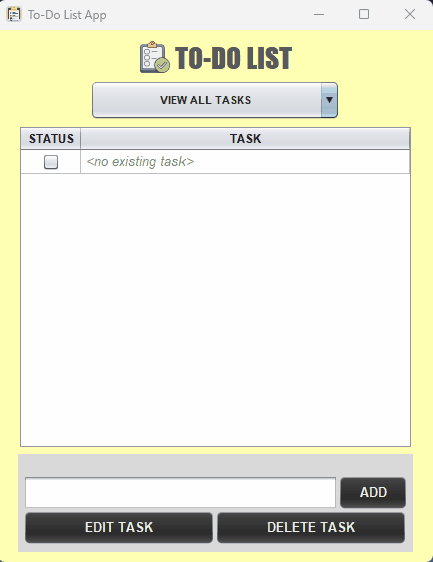
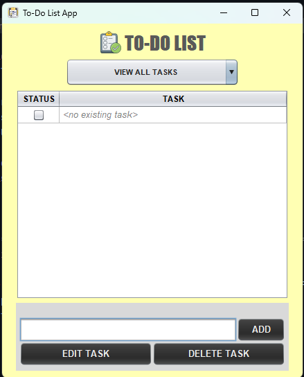
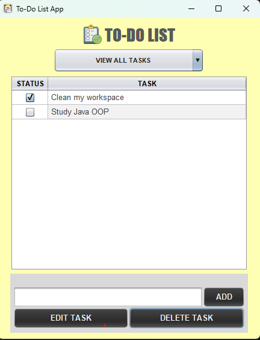

# 📝 To-Do List App

## 💡 Overview
This repository is a simple **desktop To-Do List app** I built using **Java (Swing + OOP)**. It lets you add tasks, mark them as done, and remove them—perfect for practicing Java fundamentals while making something useful.

---

## ✨ Features
✔️ Add tasks easily  
✔️ Update or edit existing task   
✔️ Delete tasks you no longer need                       
✔️ Mark tasks as complete                                                        
✔️ Switch between views: All, Pending, and Completed                               
✔️ Clean, simple Swing interface

---

## 🛠️ Built With
- **Language:** Java (JDK 17)
- **GUI:** Swing
- **IDE:** IntelliJ IDEA
- **Object-Oriented Programming** concepts
  
---                                          

## 🎥 Demo & Screenshots
*Here’s a quick demo of the File Organizer App in action:*

*Empty Task List*

*Task List with Pending & Completed Tasks*

---

## 🚀 How to Run
### 1. Requirements
- Install **Java JDK 17+**
- (Optional) Install **IntelliJ IDEA**

### 2. Run inside IntelliJ
1. Open the project in IntelliJ
2. Make sure Project SDK = Java 17
3. Open `Main.java` → click **Run ▶**

---

## 🌱 Future Improvements

These are features I’d like to add in the future:

1. 🗂️ Add categories (Work, Personal, Lifestyle)
2. 🔄 Sync tasks across multiple devices
3. 📤 Export tasks (CSV, PDF, etc.)
4. ↕️ Sort tasks (by date, category, or status)
5. 🎨 Add themes (Light / Dark mode)  

## 👤 Author
- **Kathlene Manaloto**
- [GitHub](https://github.com/KathManaloto)
- [LinkedIn](https://www.linkedin.com/in/kathlene-manaloto/)  
